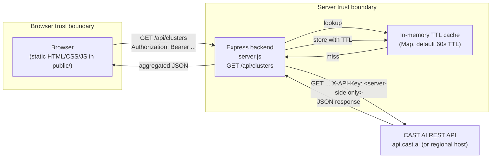

# Siemens CAST AI Dashboard

A read-only developer dashboard for inspecting CAST AI managed Kubernetes clusters
across Siemens environments. The dashboard surfaces cluster health, resource
utilization (CPU and memory), monthly cost savings, and workload optimization
opportunities fetched live from the CAST AI REST API.

The application is intentionally read-only. It does not modify clusters, nodes,
workloads, policies, or any other CAST AI resource. All CAST AI API calls happen
server-side through an Express backend that caches responses, normalizes the
schema, and forwards a safe aggregated payload to the browser.

## Architecture

The dashboard has four logical layers:

- A static browser frontend (vanilla HTML/CSS/JS) served from `public/`.
- A thin Express backend (`server.js`) that exposes one JSON endpoint.
- An in-memory TTL cache that deduplicates upstream CAST AI calls.
- The CAST AI REST API, accessed with a server-side `X-API-Key` header.



The CAST AI API key never leaves the server. The browser only ever receives
aggregated JSON that has been produced and sanitized by `server.js`.

## Data flow

The lifecycle of a single dashboard refresh is:

1. The frontend calls `GET /api/clusters` (and optionally sends a bearer token
   when `DASHBOARD_API_TOKEN` is configured).
2. The backend checks the in-memory TTL cache. For each upstream path, a
   cached payload is reused if it has not yet expired (default 60 seconds,
   tunable via `DASHBOARD_CACHE_TTL_MS`).
3. On a cache miss the backend issues an outbound `fetch` to the CAST AI REST
   API, attaching the server-side `X-API-Key` header and an `Accept:
   application/json` header, with a 15-second `AbortSignal.timeout`.
4. The backend aggregates per-cluster details for each entry returned by the
   list endpoint: it pulls node count, latest resource usage, savings totals,
   and the count of workload autoscaling optimization opportunities.
5. The aggregated array of cluster summaries is returned to the browser as
   JSON. The backend never forwards the raw CAST AI payloads and never echoes
   the API key, stack traces, or upstream error details.
6. The frontend renders one card per cluster with the fields described below.

## Authentication and security design

The dashboard is designed around a defense-in-depth posture where secrets
remain on the server and the browser is treated as an untrusted client.

- **CAST AI API key (`CASTAI_API_KEY`)** - required, read by the backend from
  the process environment. The key is used to set the `X-API-Key` header on
  outbound calls to CAST AI and is never sent to the browser. If the
  variable is missing, `GET /api/clusters` responds with HTTP 503.
- **Optional dashboard bearer token (`DASHBOARD_API_TOKEN`)** - when set, the
  backend enforces `Authorization: Bearer <token>` on every `/api/*` request
  and returns HTTP 401 on missing or mismatched tokens. Leave blank in
  development to expose the API unauthenticated on localhost only.
- **Future OIDC / Siemens IdP** - the bearer-token middleware is intentionally
  pluggable. A future iteration will swap `bearerAuth` for an OIDC verifier
  that validates a Siemens identity token before forwarding to CAST AI. The
  contract (an Express middleware that either calls `next()` or returns 401)
  will not change.
- **Least privilege** - the CAST AI API key used for the dashboard should be
  scoped to read-only operations only. The dashboard never needs to create,
  update, or delete clusters, nodes, or workloads, so a dedicated read-only
  token should be generated from the CAST AI console under
  *Settings -> API tokens*.

Other hardening notes:

- The server binds `console.log` to a single non-sensitive startup line
  (the listen port). It never logs the API key, bearer token, or upstream
  error bodies.
- Errors from CAST AI are mapped to safe HTTP statuses (`502` for upstream
  failures, `503` when the API key is not configured). The original error
  message is not forwarded to the client.
- All upstream `fetch` calls are bounded by `AbortSignal.timeout(15_000)`.

## Data model

`GET /api/clusters` returns a JSON array. Each element is a normalized
cluster summary with the following shape:

| Field                                | Type              | Description                                                                                                  |
| ------------------------------------ | ----------------- | ------------------------------------------------------------------------------------------------------------ |
| `id`                                 | string \| null    | CAST AI cluster identifier.                                                                                  |
| `name`                               | string \| null    | Human-friendly cluster name.                                                                                 |
| `status`                             | string \| null    | Cluster lifecycle state (e.g. `ready`, `pending`, `failed`, `disconnected`).                                |
| `providerType`                       | string \| null    | Cloud provider (e.g. `aws`, `gcp`, `azure`).                                                                 |
| `region`                             | string \| null    | Provider region for the cluster.                                                                             |
| `agentStatus`                        | string \| null    | CAST AI agent connectivity state (e.g. `connected`, `degraded`, `disconnected`).                            |
| `nodeCount`                          | number \| null    | Number of nodes reported by CAST AI for the cluster, or `null` if unavailable.                              |
| `resources.cpuRequested`             | number \| null    | CPU cores requested across the cluster.                                                                      |
| `resources.cpuUsed`                  | number \| null    | CPU cores currently consumed.                                                                                |
| `resources.cpuUtilization`           | number \| null    | CPU utilization as a fraction in `[0, 1]` (the frontend multiplies by 100 for display).                     |
| `resources.memoryRequested`          | number \| null    | Memory requested across the cluster.                                                                         |
| `resources.memoryUsed`               | number \| null    | Memory currently consumed.                                                                                   |
| `resources.memoryUtilization`        | number \| null    | Memory utilization as a fraction in `[0, 1]` (the frontend multiplies by 100 for display).                  |
| `savings.currentMonthlyCost`         | number \| null    | Current monthly cost reported by CAST AI (USD).                                                              |
| `savings.optimizedMonthlyCost`       | number \| null    | Projected monthly cost after CAST AI optimization (USD).                                                     |
| `savings.monthlySavings`             | number \| null    | Absolute monthly savings (USD).                                                                              |
| `savings.savingsPercentage`          | number \| null    | Savings as a fraction in `[0, 1]` (the frontend multiplies by 100 for display).                             |
| `workloadOptimizationOpportunities`  | number \| null    | Count of workloads whose CAST AI recommendation differs from the current CPU or memory request.             |

The frontend renders one card per cluster, mapping these fields to status
badges, CPU/memory bars, a Monthly Cost section, and an Optimization counter.
Numeric fields that are `null`, missing, or non-finite are displayed as
`N/A` rather than as zeros.

## Example CAST AI API queries

Replace `https://api.cast.ai` with the value of `CASTAI_REGION` when
running against a regional endpoint, and replace `$CASTAI_API_KEY` with the
read-only token created in the CAST AI console.

List external clusters:

```bash
curl -sS \
  -H "X-API-Key: $CASTAI_API_KEY" \
  -H "Accept: application/json" \
  "https://api.cast.ai/v1/kubernetes/external-clusters"
```

Get cluster details:

```bash
curl -sS \
  -H "X-API-Key: $CASTAI_API_KEY" \
  -H "Accept: application/json" \
  "https://api.cast.ai/v1/kubernetes/external-clusters/$CLUSTER_ID"
```

List cluster nodes:

```bash
curl -sS \
  -H "X-API-Key: $CASTAI_API_KEY" \
  -H "Accept: application/json" \
  "https://api.cast.ai/v1/kubernetes/external-clusters/$CLUSTER_ID/nodes"
```

Get estimated savings:

```bash
curl -sS \
  -H "X-API-Key: $CASTAI_API_KEY" \
  -H "Accept: application/json" \
  "https://api.cast.ai/v1/cost-reports/clusters/$CLUSTER_ID/savings"
```

List workload autoscaling workloads:

```bash
curl -sS \
  -H "X-API-Key: $CASTAI_API_KEY" \
  -H "Accept: application/json" \
  "https://api.cast.ai/v1/workload-autoscaling/clusters/$CLUSTER_ID/workloads"
```

Get workload autoscaling agent statuses:

```bash
curl -sS \
  -H "X-API-Key: $CASTAI_API_KEY" \
  -H "Accept: application/json" \
  "https://api.cast.ai/v1/workload-autoscaling/clusters/$CLUSTER_ID/agent-status"
```

The dashboard backend calls the first five endpoints under the hood to
build each cluster summary. The agent-status endpoint is included for
reference and future use.

## Environment setup

The dashboard reads its configuration from process environment variables.
A template is provided in `.env.example`.

```bash
cd dashboard
cp .env.example .env
# Edit .env and fill in real values
```

The supported variables are:

| Variable                   | Required | Default        | Purpose                                                                                     |
| -------------------------- | -------- | -------------- | ------------------------------------------------------------------------------------------- |
| `CASTAI_API_KEY`           | yes      | (empty)        | CAST AI API key sent as `X-API-Key`. Server-side only.                                      |
| `CASTAI_REGION`            | no       | `api.cast.ai`  | CAST AI regional host (e.g. `eu.cast.ai`, `asia.cast.ai`). Used to build the base URL.     |
| `PORT`                     | no       | `3000`         | TCP port for the dashboard HTTP server.                                                     |
| `DASHBOARD_API_TOKEN`      | no       | (empty)        | If set, requires `Authorization: Bearer <token>` on every `/api/*` request.                |
| `DASHBOARD_CACHE_TTL_MS`   | no       | `60000`        | TTL in milliseconds for cached upstream CAST AI responses.                                  |

> The `.env` file should never be committed. `.env` is git-ignored at the
> repository root.

## Run locally

From the `dashboard/` directory:

```bash
npm install
npm start
```

`npm start` runs `node server.js`. The server listens on the port
configured by `PORT` (default `3000`). Open
[http://localhost:3000](http://localhost:3000) to load the dashboard.

The frontend has no build step: `public/app.js` is plain ES2017+ and is
served directly by Express's static middleware.

## Test instructions

The dashboard ships with a node:test based suite that covers both the
HTTP backend and the frontend rendering logic.

```bash
cd dashboard
npm test
```

`npm test` runs `node --test test/server.test.js test/ui.test.js`. No
external services are required: the backend tests stub the upstream CAST
AI calls, and the UI tests load `public/app.js` into jsdom.

## End-to-end validation

To verify the dashboard against live CAST AI data:

1. Ensure `dashboard/.env` contains a valid, read-only `CASTAI_API_KEY`
   and the matching `CASTAI_REGION` (default `api.cast.ai`).
2. Start the server on a non-default port so it does not collide with
   other local services:

   ```bash
   cd dashboard
   PORT=3456 npm start
   ```

3. In another terminal, probe the backend:

   ```bash
   curl -s http://localhost:3456/api/health
   # expected: {"status":"ok"}

   curl -s http://localhost:3456/api/clusters | jq length
   # expected: a non-negative integer
   ```

4. Open `http://localhost:3456/` in a browser. The page should show the
   dashboard title and one card per cluster returned by CAST AI.
5. Click the refresh button and confirm the cards reload without a full
   page refresh.
6. Verify that the API key is not present in the HTML, `app.js`, or the
   `/api/clusters` response body.

A jsdom-driven E2E helper exists at `test/dashboard-e2e.js` for
automated validation without installing a browser framework. Run it
while the server is live on `PORT=3456`:

```bash
cd dashboard
node test/dashboard-e2e.js
```

The script loads the real HTML and JavaScript, stubs `window.fetch`
with the live `/api/clusters` payload, and asserts that cards render,
loading/error/empty states transition correctly, and no console errors
occur.

## Dev workflow

1. Install dependencies: `cd dashboard && npm install`.
2. Copy `.env.example` to `.env` and set `CASTAI_API_KEY`.
3. Start the server: `npm start` (or `PORT=3456 npm start`).
4. Edit `public/app.js` or `server.js`; refresh the browser to see
   changes (no build step).
5. Run tests before committing: `npm test`.
6. Keep `.env` out of git. The file is already git-ignored; never stage
   it.

## Troubleshooting

| Symptom | Likely cause | Fix |
| --- | --- | --- |
| `GET /api/clusters` returns `502` | CAST AI rejected the API key or the region is wrong | Check `CASTAI_API_KEY` and `CASTAI_REGION` in `.env`; verify the key with a direct `curl -H "X-API-Key: $CASTAI_API_KEY" https://$CASTAI_REGION/v1/kubernetes/external-clusters`. |
| `GET /api/clusters` returns `503` | `CASTAI_API_KEY` is missing or empty | Set a valid key in `.env` or in the process environment. |
| Region cell shows `[object Object]` (fixed) | Real CAST AI API returns `region` as `{name, displayName}` | Already handled in `public/app.js`; if it reappears, coerce the field to `region.displayName \|\| region.name`. |
| UI tests fail with `loadServer` dotenv leak | A `.env` file is present and `process.env.CASTAI_API_KEY` was deleted rather than blanked | Fixed in `test/server.test.js`; isolated env vars are set to `''` before re-requiring `server.js`. |
| Browser shows an error banner | `/api/clusters` returned a non-2xx status | Check the server logs; the response body is intentionally sanitized and never contains the API key. |
| `npm test` hangs | A previous `node server.js` may still be running | Find and kill the process (`lsof -iTCP:3000` or the port you chose). |

## CAST AI documentation links

- CAST AI REST API reference:
  <https://docs.cast.ai/reference/getting-started-with-cast-ai-api>
- CAST AI public documentation:
  <https://docs.cast.ai/docs/introduction-to-cast-ai>
- Regional endpoints:
  <https://docs.cast.ai/docs/regions>
- Read-only API token guidance:
  <https://docs.cast.ai/docs/creating-an-api-token>
- Workload autoscaler:
  <https://docs.cast.ai/docs/workload-autoscaler>
- Cost reports and savings:
  <https://docs.cast.ai/docs/cost-monitoring>
