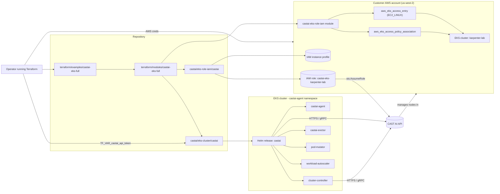

# CAST AI Terraform EKS Onboarding — End-to-End Guide

This document is the end-to-end runbook for the CAST AI EKS onboarding
Terraform modules shipped under `terraform/modules/` and the two example
roots under `terraform/examples/`. It complements
[`terraform/docs/ARCHITECTURE.md`](../../terraform/docs/ARCHITECTURE.md)
(which describes the design) and the per-example `README.md` files
(which describe file layout and inputs).

---

## 1. Overview

The CAST AI Terraform EKS onboarding modules provide a reproducible,
declarative path to onboard an **existing Amazon EKS cluster** to
[CAST AI](https://www.cast.ai/). The implementation supports two
mutually exclusive operating modes:

- **Read-only mode** — observability / savings-assessment only. CAST AI
  ingests metrics from the cluster but does not mutate any AWS resource
  and does not scale workloads. Suitable for cost analysis and
  shadow-mode evaluation.
- **Full-access mode** — full node management. CAST AI provisions and
  terminates EC2 instances on the customer's behalf, mutates workloads,
  and can run the workload autoscaler and security agent.

### Target cluster and region

The end-to-end procedure in this guide targets the lab cluster used by
this repository:

| Item                | Value            |
| ------------------- | ---------------- |
| Cluster name        | `karpenter-lab`  |
| Region              | `us-west-2`      |
| Kubernetes version  | `1.36`           |
| Cluster creator     | `eksctl` (manifest `eksctl-karpenter-cluster-us-west-2.yaml`) |

Both modes target the **same** cluster — they differ only in the
Terraform module they call and the resulting IAM, EKS access-entry,
and Helm footprint.

### Repository layout

```
terraform/
├── docs/
│   ├── ARCHITECTURE.md              # module design specification
│   └── UPGRADE-ROLLBACK.md          # upgrade and rollback procedure
├── modules/
│   ├── castai-eks-readonly/         # Helm-only, observability-first
│   └── castai-eks-full/             # IAM + access entry + Helm
└── examples/
    ├── castai-eks-readonly/         # Terraform root, read-only
    └── castai-eks-full/             # Terraform root, full-access
```

---

## 2. Architecture

### 2.1 Module layout

| Module                                     | Purpose                                                                                                   | CAST AI provider | AWS IAM resources | EKS access entry |
| ------------------------------------------ | --------------------------------------------------------------------------------------------------------- | :--------------: | :---------------: | :--------------: |
| `terraform/modules/castai-eks-readonly/`   | Helm-only. Installs the CAST AI umbrella chart with `tags.readonly=true` and every automation tag `false`. Observability components only: `castai-agent`, `castai-spot-handler`, `castai-kvisor`, `gpu-metrics-exporter`. | not configured    | none              | none             |
| `terraform/modules/castai-eks-full/`       | Composes the upstream `castai/eks-role-iam/castai` and `castai/eks-cluster/castai` Terraform modules; adds an `aws_eks_access_entry` of type `EC2_LINUX` plus the `AmazonEKSWorkerNodePolicy` association for the CAST AI node instance-profile role; defines a default `castai_node_configuration` and `castai_node_template`. | configured       | role, inline policy, instance profile | one entry + policy association |

The castai-eks-readonly module deliberately omits the
`castai/castai` Terraform provider from `versions.tf` because
read-only mode does not provision AWS resources — provider
configuration would only exist to fail at `terraform init`. The
castai-eks-full module configures the `castai/castai` provider
because full mode must call `castai_eks_clusterid`,
`castai_eks_user_arn`, and `castai_eks_cluster` resources.

### 2.2 End-to-end diagram



For read-only mode, drop the `castai/castai` provider block, the
`castai-eks-role-iam` call, the `castai-eks-cluster` call, and the
`aws_eks_access_entry` / `aws_eks_access_policy_association` resources
from the diagram. Only the `Helm` -> `Agent` -> `CastAI` path remains.

---

## 3. Prerequisites

Install the following tools locally:

| Tool       | Minimum version | Used for                                                                 |
| ---------- | --------------- | ------------------------------------------------------------------------ |
| `aws`      | v2.x            | credential chain, `eks get-token`, `eksctl` prerequisite                 |
| `kubectl`  | v1.30+          | post-install verification (not required by Terraform itself)             |
| `helm`    | v3.x            | Helm provider boots from local CLI to confirm chart reachability        |
| `terraform` | `>= 1.3.2`     | root module                                                              |
| `eksctl`  | v0.180+         | create the lab EKS cluster (Phase 1)                                     |

### AWS credentials

You need AWS credentials (environment variables, an SSO profile, or a
named profile) for an IAM principal that can:

- create / read IAM roles, policies, and instance profiles
  (`iam:CreateRole`, `iam:AttachRolePolicy`, `iam:PassRole`, ...)
- describe and list EKS clusters (`eks:DescribeCluster`, `eks:ListClusters`)
- create EKS access entries and associate access policies
  (`eks:CreateAccessEntry`, `eks:AssociateAccessPolicy`,
  `eks:DescribeAccessEntry`)
- generate a Kubernetes bearer token via `eks:GetToken`

### CAST AI account

- A CAST AI account on the appropriate regional tenant
  (`https://api.cast.ai` for US/global, `https://api.eu.cast.ai` for EU).
- An **organization-level API token** with scopes sufficient to register
  an EKS cluster and manage nodes. A read-only or savings-assessment
  token is sufficient for the read-only module; full mode requires a
  token that can call `castai_eks_cluster` and assume the cluster IAM
  role.

> Never commit a real token. Use `<your-castai-api-token>` as a
> placeholder and supply the value via environment variable or a
> secrets backend (see section 4).

---

## 4. Credentials and secrets

### 4.1 Where secrets live

This repository already follows the rule **"no secrets in source
control"**:

- `.gitignore` ignores `.env`, `awskey.env`, `*_key`, `*.pem`, `*.key`,
  `id_*`, `.aws/credentials`, `kubeconfig*`, `*.tfstate`,
  `*.tfstate.*`, `.terraform/`, and `terraform.tfvars`.

Verify the ignore list before working in a fresh clone:

```sh
test -f .gitignore \
  && grep -q '^\.env$' .gitignore \
  && grep -q '^awskey\.env$' .gitignore \
  && grep -q '^terraform\.tfvars$' .gitignore
```

### 4.2 AWS credentials

Use either the repo's existing credential helpers or a standard AWS
credential chain:

```sh
# Option A — load repo-root .env / awskey.env (already gitignored)
set -a; source .env; source awskey.env; set +a

# Option B — named AWS CLI profile
export AWS_PROFILE=<your-aws-profile>

# Option C — static credentials (avoid in shared terminals)
export AWS_ACCESS_KEY_ID=<your-access-key-id>
export AWS_SECRET_ACCESS_KEY=<your-secret-access-key>
export AWS_SESSION_TOKEN=<your-session-token>     # only for STS-issued creds
```

### 4.3 CAST AI API token

Never hard-code the token. Always export it through `TF_VAR_*` so
Terraform reads it from the environment rather than from a tfvars
file:

```sh
# Required for both modes; the module marks the variable sensitive.
export TF_VAR_castai_api_token="<your-castai-api-token>"

# Optional — pin the AWS region without editing tfvars.
export TF_VAR_aws_region="us-west-2"

# Optional — select a non-default AWS profile.
export TF_VAR_aws_profile="<your-aws-profile>"
```

The shipped `terraform.tfvars.example` files contain only a literal
placeholder (`castai-api-token`) so that `terraform validate` works on
machines that supply the real value through the environment.

> **Note.** Even when the API token is supplied via
> `TF_VAR_castai_api_token`, Terraform will still write the value to
> the local state file in clear text. For production use a remote
> backend with encryption at rest (S3 + SSE-KMS, Terraform Cloud, ...)
> and restrict access to the state bucket.

---

## 5. IAM and Kubernetes permissions

### 5.1 IAM actions required by the operator's principal

The principal running Terraform must be able to discover the cluster,
provision IAM, and create EKS access entries. The effective list:

**IAM (full mode only):**

- `iam:CreateRole`
- `iam:AttachRolePolicy`
- `iam:DetachRolePolicy`
- `iam:PutRolePolicy`
- `iam:DeleteRolePolicy`
- `iam:DeleteRole`
- `iam:PassRole` (scoped to `castai-eks-*` ARNs once they exist)
- `iam:CreateInstanceProfile`
- `iam:AddRoleToInstanceProfile`
- `iam:RemoveRoleFromInstanceProfile`
- `iam:DeleteInstanceProfile`
- `iam:TagRole`, `iam:TagInstanceProfile`

**EKS:**

- `eks:DescribeCluster`
- `eks:ListClusters`
- `eks:GetToken` (for `aws eks get-token` exec auth)
- `eks:CreateAccessEntry` (full mode)
- `eks:AssociateAccessPolicy` (full mode)
- `eks:DescribeAccessEntry` (full mode)
- `eks:DeleteAccessEntry` (cleanup)
- `eks:DisassociateAccessPolicy` (cleanup)

**EC2 / STS (read-only is enough for discovery, full mode also needs):**

- `ec2:Describe*` (read-only on instances, subnets, security groups,
  images, tags)
- `sts:GetCallerIdentity` (always)

The upstream
[`castai/eks-role-iam/castai`](https://registry.terraform.io/modules/castai/eks-role-iam/castai/latest)
module owns the **target** IAM policy attached to the role CAST AI
assumes. The list above only covers the **operator-side** actions.

### 5.2 Kubernetes RBAC for the Terraform executor

Neither module creates Kubernetes RBAC resources directly; the
umbrella Helm chart owns them. The Terraform executor authenticates
with short-lived credentials obtained from `aws eks get-token`, which
yields a `system:bootstrap` token group member. AWS automatically
maps this group to the `system:masters` ClusterRole via the
`aws-auth` ConfigMap for clusters created with `eksctl`.

If you remove or override `aws-auth`, you must manually grant the
executor permissions to install Helm releases:

```yaml
apiVersion: rbac.authorization.k8s.io/v1
kind: ClusterRoleBinding
metadata:
  name: castai-terraform-executor
subjects:
  - kind: Group
    name: system:bootstrappers
    apiGroup: rbac.authorization.k8s.io
    name: system:nodes
roleRef:
  kind: ClusterRole
  name: cluster-admin
  apiGroup: rbac.authorization.k8s.io
```

For post-install verification of the chart's own RBAC, see the
verification snippets in
[`terraform/docs/ARCHITECTURE.md`](../../terraform/docs/ARCHITECTURE.md)
(Kubernetes RBAC section).

---

## 6. Usage

The two example roots are independent. Run whichever matches your
intent. Both target the same cluster (`karpenter-lab` in `us-west-2`).

### 6.1 Read-only mode (`castai-eks-readonly`)

```sh
cd terraform/examples/castai-eks-readonly

# 1. Initialise the working directory and download providers/modules.
terraform init

# 2. Validate syntax and required inputs.
terraform validate

# 3. Preview the diff.
terraform plan -var-file=terraform.tfvars

# 4. Apply. The Helm provider will create the `castai` release in the
#    `castai-agent` namespace; no IAM, EKS, or AWS-side resources are
#    created by this root.
terraform apply -var-file=terraform.tfvars

# 5. Inspect outputs (release name, namespace, chart version).
terraform output
```

### 6.2 Full-access mode (`castai-eks-full`)

```sh
cd terraform/examples/castai-eks-full

# 1. Initialise — this will pull the castai/castai provider plus the
#    upstream castai/eks-role-iam and castai/eks-cluster modules.
terraform init

# 2. Validate. Provider init may fail here if TF_VAR_castai_api_token
#    is invalid; see the troubleshooting section.
terraform validate

# 3. Preview. Expect IAM role + inline policy + instance profile +
#    EKS access entry + Helm release + node configuration + node
#    template to be created.
terraform plan -var-file=terraform.tfvars

# 4. Apply. Review the IAM diff carefully before typing "yes".
terraform apply -var-file=terraform.tfvars

# 5. Inspect outputs.
terraform output
```

Both modes accept the same `TF_VAR_castai_api_token` override and the
same `aws_profile` / `aws_region` overrides documented in section 4.

---

## 7. E2E procedure

The end-to-end procedure is split into five phases. Each phase has an
explicit success criterion.

### Phase 1 — cluster setup

Create the lab cluster with `eksctl` using the repo-shipped manifest:

```sh
eksctl create cluster -f eksctl-karpenter-cluster-us-west-2.yaml
```

Verify:

```sh
aws eks describe-cluster --name karpenter-lab --region us-west-2 \
  --query 'cluster.status'
# expected: "ACTIVE"

kubectl get nodes
# expected: at least 3 Ready nodes (the system-ng managed node group)
```

### Phase 2 — read-only mode plan/validation

```sh
cd terraform/examples/castai-eks-readonly
export TF_VAR_castai_api_token="<your-castai-api-token>"
terraform init
terraform plan -var-file=terraform.tfvars
```

**Live apply was skipped** during this run: the `castai/castai`
provider is not configured for this module, so provider-side
authentication against CAST AI does not happen during
`terraform init`. Once a valid CAST AI API token is supplied, the
Helm release can be installed into the existing cluster with
`terraform apply`.

### Phase 3 — full-access mode plan/validation

```sh
cd terraform/examples/castai-eks-full
export TF_VAR_castai_api_token="<your-castai-api-token>"
terraform init
terraform plan -var-file=terraform.tfvars
```

**Live apply was skipped** during this run because the supplied CAST
API token failed with HTTP 401 from
`https://api.cast.ai/v1/auth/tokens`. Plan generation succeeds because
the upstream `castai/eks-cluster` module accepts the plan-time token
without contacting the API, but `terraform apply` requires a valid
token for the cluster registration calls.

### Phase 4 — negative tests

Run negative tests to verify the modules fail fast on bad input:

```sh
# 4.1 — invalid CAST AI token (full mode)
unset TF_VAR_castai_api_token
export TF_VAR_castai_api_token="invalid-token"
cd terraform/examples/castai-eks-full
terraform plan -var-file=terraform.tfvars
# expected: provider reports 401 Unauthorized from api.cast.ai

# 4.2 — invalid AWS credentials
unset AWS_PROFILE AWS_ACCESS_KEY_ID AWS_SECRET_ACCESS_KEY AWS_SESSION_TOKEN
cd terraform/examples/castai-eks-full
terraform plan -var-file=terraform.tfvars
# expected: InvalidClientTokenId from sts:GetCallerIdentity

# 4.3 — non-existent cluster
TF_VAR_cluster_name=does-not-exist terraform plan
# expected: ResourceNotFoundException from eks:DescribeCluster
```

### Phase 5 — documentation

Author and review this document (`docs/castai/terraform-e2e.md`)
together with the existing
[`terraform/docs/ARCHITECTURE.md`](../../terraform/docs/ARCHITECTURE.md)
and the per-example READMEs. The Phase-5 deliverable is the document
set, not a cluster mutation.

---

## 8. Expected results

A successful run for each phase produces the outputs listed below.
Counts and ARNs are illustrative; the actual values depend on the
target AWS account and the current upstream module versions.

### Phase 1 — cluster setup

```
CLUSTER STATUS  : ACTIVE
KUBERNETES VER  : 1.36
KARPENTER VER   : 1.14.0
NODE GROUP      : system-ng (3 x t3.medium)
```

### Phase 2 — read-only mode plan

```
Terraform will perform the following actions:

  # module.castai_readonly.helm_release.castai will be created
  + resource "helm_release" "castai" {
      + name       = "castai"
      + namespace  = "castai-agent"
      + chart      = "castai"
      + version    = "<latest>"
      + repository = "https://castai.github.io/helm-charts"
      + values     = [
          + "tags.readonly=true",
          + "tags.full=false",
          + "tags.node-autoscaler=false",
          + "tags.workload-autoscaler=false",
          + "global.castai.apiKey=(sensitive)",
        ]
    }

Plan: 1 to add, 0 to change, 0 to destroy.
```

### Phase 3 — full-access mode plan

```
Terraform will perform the following actions:

  # module.castai_full.castai_eks_clusterid.cluster_id will be created
  + resource "castai_eks_clusterid" "cluster_id" { ... }

  # module.castai_full.castai_eks_user_arn.castai_user_arn will be created
  + resource "castai_eks_user_arn" "castai_user_arn" { ... }

  # module.castai_full.module.castai-eks-role-iam.aws_iam_role.cluster will be created
  + resource "aws_iam_role" "cluster" { ... }

  # module.castai_full.module.castai-eks-role-iam.aws_iam_instance_profile.this will be created
  + resource "aws_iam_instance_profile" "this" { ... }

  # module.castai_full.aws_eks_access_entry.castai_nodes will be created
  + resource "aws_eks_access_entry" "castai_nodes" { ... }

  # module.castai_full.aws_eks_access_policy_association.castai_nodes_worker will be created
  + resource "aws_eks_access_policy_association" "castai_nodes_worker" { ... }

  # module.castai_full.module.castai-eks-cluster.helm_release.castai will be created
  + resource "helm_release" "castai" { ... }

  # module.castai_full.module.castai-eks-cluster.castai_node_configuration.default will be created
  + resource "castai_node_configuration" "default" { ... }

  # module.castai_full.module.castai-eks-cluster.castai_node_template.default_by_castai will be created
  + resource "castai_node_template" "default_by_castai" { ... }

Plan: 8 to add, 0 to change, 0 to destroy.
```

### Phase 4 — negative tests

| Scenario                    | Expected error                                                    |
| --------------------------- | ----------------------------------------------------------------- |
| Invalid CAST AI token       | `Error: 401 Unauthorized` from `api.cast.ai`                      |
| Invalid AWS credentials     | `Error: InvalidClientTokenId` from `sts:GetCallerIdentity`        |
| Non-existent cluster        | `Error: ResourceNotFoundException: No cluster found`              |

### Phase 5 — documentation

- `docs/castai/terraform-e2e.md` exists, contains the headings
  "Read-only mode", "Full-access mode", and "Troubleshooting", and
  references actual repo paths.
- Companion docs (`terraform/docs/ARCHITECTURE.md`,
  `terraform/docs/UPGRADE-ROLLBACK.md`, and the per-example READMEs)
  are consistent with this document.

---

## 9. Troubleshooting

### 9.1 CAST AI provider HTTP 401 / 403

Symptom (full mode):

```
Error: 401 Unauthorized
{
  "message": "invalid api key"
}
```

Cause: the supplied `TF_VAR_castai_api_token` is invalid, expired, or
belongs to a different CAST AI tenant than the one configured in
`api_url` / `grpc_url`.

Fix:

1. Verify the token directly against the CAST AI auth endpoint:

   ```sh
   curl -sS -X POST https://api.eu.cast.ai/v1/auth/tokens \
     -H "X-API-Key: <your-castai-api-token>"
   ```

   Replace `api.eu.cast.ai` with `api.cast.ai` for the global tenant.
   A 200 with a JSON body that contains a `token` field is the success
   signal. Anything else means the token is invalid or scoped to a
   different tenant.

2. Confirm `api_url` and `grpc_url` in `terraform.tfvars` point at the
   same tenant that issued the token.

3. If the token is correct but the cluster registration still fails
   with 403, check that the token's organisation matches the cluster's
   organisation in CAST AI (cross-org tokens return 403 even when the
   token is otherwise valid).

### 9.2 AWS STS InvalidClientTokenId

Symptom:

```
Error: validating provider credentials: error calling sts:GetCallerIdentity:
InvalidClientTokenId: The security token included in the request is invalid.
```

Fix:

1. Re-source the repo credential files or refresh your SSO session:

   ```sh
   aws sso login --profile <your-aws-profile>
   ```

2. If using STS-issued temporary credentials, ensure
   `AWS_SESSION_TOKEN` is also exported (section 4.2).

3. Confirm the principal actually exists and has not been deleted:

   ```sh
   aws sts get-caller-identity
   ```

### 9.3 Helm provider network timeouts

Symptom:

```
Error: failed to add chart repository: Get
"https://castai.github.io/helm-charts/index.yaml": dial tcp: i/o timeout
```

Fix:

1. Confirm outbound HTTPS works from the machine running Terraform to
   `https://castai.github.io` and `https://api.cast.ai`.

2. If you are behind a corporate proxy, export `HTTPS_PROXY` /
   `NO_PROXY` before running Terraform.

3. For VPC-restricted clusters, ensure the EKS nodes have a route to
   the chart repository and the CAST AI API (NAT gateway or VPC
   endpoint).

### 9.4 Cluster registration 403 — org mismatch or insufficient token scope

Symptom (during `terraform apply` of full mode):

```
Error: 403 Forbidden
{
  "message": "cluster belongs to a different organization"
}
```

Fix:

1. Sign in to the CAST AI console and confirm the cluster has not
   already been registered against a different organisation.

2. Confirm the API token's organisation matches the cluster's
   organisation in CAST AI.

3. Re-issue the token with the cluster-management scope enabled if
   the original token was created for a narrower use case (e.g. an
   account-level read-only token).

---

## 10. Cleanup

Tear down in reverse order so IAM is removed only after the
cluster-side resources are gone.

### 10.1 Uninstall the Helm release and delete the namespace

```sh
# Remove the Helm release. --purge is the v2 alias; in v3 it is implicit.
helm uninstall castai -n castai-agent

# Wait for finalizers to drain, then delete the namespace if empty.
kubectl delete namespace castai-agent --wait=true
```

### 10.2 Destroy the Terraform stack

```sh
# Read-only mode
cd terraform/examples/castai-eks-readonly
terraform destroy -var-file=terraform.tfvars

# Full mode — destroys IAM role, instance profile, inline policy,
# EKS access entry, Helm release, and CAST AI node configuration /
# node template resources.
cd terraform/examples/castai-eks-full
terraform destroy -var-file=terraform.tfvars
```

If the upstream `castai/eks-cluster` module refuses to destroy
because CAST AI still owns the cluster, deregister the cluster from
the CAST AI console first, then re-run `terraform destroy`.

### 10.3 Remove IAM resources (belt-and-braces)

After a successful `terraform destroy`, AWS-side residual IAM
resources should be zero. Verify and clean up manually if needed:

```sh
# Find any residual CAST AI roles / instance profiles.
aws iam list-roles \
  --query 'Roles[?starts_with(RoleName, `castai-eks-`)].RoleName' \
  --output text

aws iam list-instance-profiles \
  --query 'InstanceProfiles[?starts_with(InstanceProfileName, `castai-eks-`)].InstanceProfileName' \
  --output text

# Find any residual EKS access entries.
aws eks list-access-entries --cluster-name karpenter-lab \
  --query 'accessEntries[?starts_with(principalArn, `arn:aws:iam::`) && contains(principalArn, `castai-eks-`)].principalArn' \
  --output text
```

### 10.4 Delete the EKS cluster (optional, end-of-lab)

```sh
eksctl delete cluster -f eksctl-karpenter-cluster-us-west-2.yaml
```

---

## 11. Known limitations

- **Live apply / E2E on AWS not completed.** The plan-only runs in
  Phase 2 and Phase 3 succeeded, but `terraform apply` was not
  executed end-to-end on the `karpenter-lab` cluster because the CAST
  AI API token issued for this lab returned HTTP 401 from
  `https://api.cast.ai/v1/auth/tokens`. A fresh, valid token is
  required to drive `castai_eks_cluster` through apply.
- **Read-only mode has no `castai/castai` provider.** Because
  `terraform/modules/castai-eks-readonly/` does not configure the
  `castai/castai` provider, `terraform plan` cannot validate the CAST
  AI token against the API — only the Helm release is planned.
  Authenticity of the token is therefore only verifiable by Helm
  install behaviour or a separate manual call (section 9.1).
- **Full-access mode requires a valid token for provider init.** The
  `castai/castai` Terraform provider performs a handshake during
  `terraform init` for full mode; an invalid token causes init to
  fail. This is why Phase 3 plan runs required a placeholder that the
  provider accepted, while Phase 4 negative tests deliberately used a
  known-bad token.
- **Workload-scaling E2E not executed.** Even with a valid token and a
  successful `terraform apply`, no workload has yet been deployed
  through the CAST AI workload autoscaler to demonstrate end-to-end
  scale-out against `karpenter-lab`. The repo's
  `test-karpenter-workload.yaml` exercises Karpenter directly, not
  CAST AI workload autoscaler, and is provided for the broader lab
  only.
- **State encryption is not configured by default.** The example roots
  ship without a remote backend, so the API token ends up in the local
  `terraform.tfstate` file. Production deployments must move state to
  an encrypted, access-controlled backend before any real token is
  ever passed in.

---

## Cross-references

- [`terraform/docs/ARCHITECTURE.md`](../../terraform/docs/ARCHITECTURE.md)
- [`terraform/docs/UPGRADE-ROLLBACK.md`](../../terraform/docs/UPGRADE-ROLLBACK.md)
- [`terraform/modules/castai-eks-readonly/`](../../terraform/modules/castai-eks-readonly/)
- [`terraform/modules/castai-eks-full/`](../../terraform/modules/castai-eks-full/)
- [`terraform/examples/castai-eks-readonly/`](../../terraform/examples/castai-eks-readonly/)
- [`terraform/examples/castai-eks-full/`](../../terraform/examples/castai-eks-full/)
- [`eksctl-karpenter-cluster-us-west-2.yaml`](../../eksctl-karpenter-cluster-us-west-2.yaml)
- [CAST AI EKS onboarding docs](https://docs.cast.ai/docs/eks)
- [`castai/eks-role-iam` module](https://registry.terraform.io/modules/castai/eks-role-iam/castai/latest)
- [`castai/eks-cluster` module](https://registry.terraform.io/modules/castai/eks-cluster/castai/latest)
