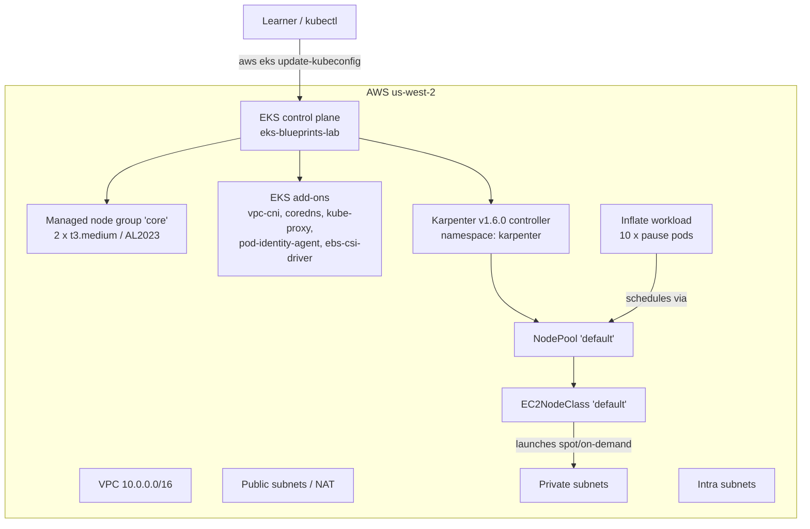

# AWS EKS Blueprints Lab — Learning Guide

## What this lab builds

A realistic, current-practice Amazon EKS learning environment using the official
Terraform modules:

- `terraform-aws-modules/eks/aws` for the cluster and managed node groups.
- `terraform-aws-modules/vpc/aws` for the VPC, subnets, and NAT gateways.
- `aws-ia/eks-blueprints-addons/aws` for EKS add-ons (vpc-cni, coredns, kube-proxy,
  eks-pod-identity-agent, aws-ebs-csi-driver) and the Karpenter helm chart.

> This lab intentionally does **not** use the deprecated monolithic
> `terraform-aws-eks-blueprints` module. That module was split into the modular
> approach used here.

## Architecture overview



## Key concepts

### Plain `terraform-aws-modules/eks/aws` vs `aws-ia/eks-blueprints-addons/aws`

These two modules are complementary, not competing — the blueprints lab uses both
side-by-side. The table below clarifies what each module owns.

| Aspect | `terraform-aws-modules/eks/aws` | `aws-ia/eks-blueprints-addons/aws` |
|--------|----------------------------------|-------------------------------------|
| Maintained by | `terraform-aws-modules` community (Anton Babenko) | AWS IaC (formerly `terraform-aws-eks-blueprints`) |
| Scope | Cluster control plane, access entries, IAM, managed node groups, basic EKS add-ons | Add-ons only: VPC CNI, CoreDNS, kube-proxy, EBS/EFS CSI drivers, Pod Identity agent, Karpenter, ArgoCD, etc. |
| Cluster dependency | None — creates the cluster itself | Requires an existing cluster ARN/endpoint as input |
| Add-on configuration style | You write separate Helm releases or `kubernetes_manifest` resources | Single module call with `enable_*` flags and tested defaults |
| IAM wiring for add-ons | Manual IRSA / Pod Identity associations per chart | Module wires IRSA or Pod Identity associations automatically |
| Version pinning | You choose each chart version and `values` yourself | Per-add-on `chart_version` / `service_account_version` defaults kept current by AWS |
| When to use | You want minimal dependencies and full control over every add-on | You want opinionated, upstream-aligned defaults and less wiring |
| This lab | Cluster, `core` managed node group, and the `aws_eks_pod_identity_association` resources | All five EKS add-ons (vpc-cni, coredns, kube-proxy, pod-identity-agent, ebs-csi-driver) plus the Karpenter Helm release |

> The deprecated monolithic `terraform-aws-eks-blueprints` (single module that did
> everything) was split into these two modular components — that is why this lab
> pulls them in separately.

### Managed node groups vs Karpenter

Both run EC2 instances for the cluster, but they answer very different operational
questions.

| Aspect | Managed node groups (MNG) | Karpenter |
|--------|---------------------------|-----------|
| Provisioning | EKS creates and updates EC2 Auto Scaling Groups | Karpenter launches EC2 instances directly (no ASG layer) |
| Scaling model | Reactive — ASG watches `desired/min/max` | Proactive — observes unschedulable pods and provisions in seconds |
| Scaling speed | 1–3 minutes per scale-out event | Typically 15–30 s from pending pod to running node |
| Instance selection | Fixed instance list per group | Any instance type satisfying NodePool `requirements` (cost-optimized) |
| Spot support | Separate MNG or mixed-instances policy | First-class — `karpenter.sh/capacity-type` in `requirements` |
| Interruption handling | ASG lifecycle hooks (slower, no SQS) | Native SQS-driven interruption queue (pre-emptive consolidation) |
| Lifecycle ownership | AWS owns nodes; you own ASG configuration | You own NodePool + EC2NodeClass; Karpenter owns the EC2 fleet |
| Drain behaviour | ASG termination lifecycle → SIGTERM after timeout | Karpenter `terminationGracePeriod`, then deprovisions |
| Best fit | Stable, long-lived capacity (controllers, core add-ons) | Variable, batch, cost-sensitive, mixed-instance workloads |
| This lab | `core` MNG (2 × t3.medium on AL2023) runs the Karpenter controller and core system pods | Provisions spot nodes for the `inflate` deployment (10 replicas) |

This lab uses both: the `core` managed node group guarantees the Karpenter
controller is always schedulable; Karpenter handles elastic, cost-aware capacity
for the demo workload.

### EKS add-ons vs self-managed add-ons

EKS add-ons are AWS-curated, versioned, and patched container images for common
Kubernetes operational software. Self-managed add-ons are whatever you install
yourself (typically via Helm). The table below contrasts the two.

| Aspect | EKS managed add-ons | Self-managed add-ons (Helm / manifests) |
|--------|---------------------|----------------------------------------|
| Image / chart source | AWS-curated images, pinned to Kubernetes minor versions | Any chart or image you choose |
| Installation | `enable_*` flag in the add-ons module (or `aws eks create-addon`) | Helm release or `kubectl apply` |
| Upgrades | One-click via EKS console/API; AWS tests compatibility | You bump chart versions and manage conflicts yourself |
| IAM permissions | Module wires IRSA or Pod Identity automatically | You write the trust policy and role by hand |
| Security patching | AWS ships CVE fixes for supported add-ons | You patch when you upgrade the chart |
| Configuration freedom | Constrained to fields AWS exposes | Full chart `values` and CRDs available |
| Supported in this lab | vpc-cni, coredns, kube-proxy, eks-pod-identity-agent, aws-ebs-csi-driver | Karpenter (no EKS-managed equivalent yet) |
| This lab's wiring | All five add-ons installed via `aws-ia/eks-blueprints-addons/aws` (`enable_vpc_cni = true`, `enable_coredns = true`, etc.) | Karpenter installed as a self-managed add-on from the same module via `enable_karpenter = true` |

### IRSA vs EKS Pod Identity

Both let pods assume AWS IAM roles without long-lived credentials. Pod Identity is
the newer, simpler model and is what this lab uses.

| Feature | IRSA (IAM Roles for Service Accounts) | EKS Pod Identity |
|---------|--------------------------------------|------------------|
| Introduced | 2019 | 2023 (GA November 2023) |
| Trust model | OIDC provider on the cluster; `sts:AssumeRoleWithWebIdentity` in trust policy | EKS Pod Identity service (`pods.eks.amazonaws.com`) — no OIDC trust policy |
| Association mechanism | `eks.amazonaws.com/role-arn` annotation on the ServiceAccount | `aws_eks_pod_identity_association` Terraform resource (no annotation) |
| Required agent | None — kubelet calls STS directly | `eks-pod-identity-agent` DaemonSet on every node |
| Cross-account roles | Awkward — each cross-account role needs explicit trust | Native — association can target roles in other AWS accounts |
| Session tags | `aud` / `sub` claims from the OIDC token | Automatic session tags (`aws:RequestedRegion`, etc.) for finer `Condition` policies |
| Scoping granularity | Per ServiceAccount | Per (namespace, ServiceAccount) pair |
| Terraform wiring | `kubernetes_service_account` annotation + `aws_iam_role` trust | Single `aws_eks_pod_identity_association` resource per SA |
| Status | Supported, considered legacy for new clusters | Recommended default for new clusters (and required by some newer AWS services) |
| This lab | Not used | Karpenter controller (`karpenter` SA in `karpenter` namespace) and the EBS CSI driver via `aws_eks_pod_identity_association` |

## Cleanup

1. Delete Karpenter-managed workloads and nodes:
   ```bash
   kubectl delete deployment inflate
   kubectl delete nodepool default
   kubectl delete ec2nodeclass default
   # Wait for Karpenter to terminate any nodes it created
   ```
2. Destroy AWS infrastructure:
   ```bash
   cd labs/aws-terraform-eks-blueprints
   terraform destroy -auto-approve
   ```
3. Verify no EC2 instances remain:
   ```bash
   aws ec2 describe-instances --filters Name=tag:Environment,Values=lab
   ```

## Cost notes

- EKS control plane: ~$0.10/hour.
- 2 x t3.medium managed nodes: ~$0.04/hour each.
- Karpenter spot nodes: billed per second while running.
- NAT gateway: ~$0.045/hour plus data-processing charges.
- Always run `terraform destroy` when finished to avoid unexpected charges.

## Reproduction commands

```bash
# 1. Configure credentials
# Use any of: aws configure, AWS_PROFILE, or a local env file.
# Example using a local env file:
#   source ./awskey.env
export AWS_REGION=us-west-2

# 2. Initialize and apply
cd labs/aws-terraform-eks-blueprints
cp terraform.tfvars.example terraform.tfvars
terraform init
terraform apply -auto-approve

# 3. Configure kubectl
aws eks --region us-west-2 update-kubeconfig --name $(terraform output -raw cluster_name)

# 4. Verify the cluster
kubectl get nodes
kubectl get pods -n kube-system

# 5. Deploy Karpenter
export CLUSTER_NAME=$(terraform output -raw cluster_name)
export KARPENTER_NODE_INSTANCE_PROFILE_NAME=$(terraform output -raw karpenter_node_instance_profile_name)
kubectl apply -f k8s/karpenter-nodepool.yaml
envsubst < k8s/karpenter-nodeclass.yaml | kubectl apply -f -

# 6. Run the autoscaling demo
kubectl apply -f k8s/inflate.yaml
kubectl scale deployment inflate --replicas=10
sleep 120
kubectl get nodes -l karpenter.sh/nodepool=default
kubectl get pods

# 7. Clean up
kubectl delete -f k8s/
terraform destroy -auto-approve
```
