# CAST AI savings cases — one diagram

**Glossary (read first):**

- **WAS = Workload Autoscaler** — CAST AI continuously right-sizes pod CPU/RAM *requests* (the VPA track). Savings call: **`workloadAutoscalerSavings`**.
- **Node Autoscaler (CAST AI node management)** — CAST AI chooses and bins the *nodes* themselves (or steers Karpenter consolidation in integration mode). Savings call: **`autoscalerSavings` / `totalSavings`** (equal, verified).
- The two tracks are **independent** and must **never be added together**.

```mermaid
flowchart TD
    A["📦 Any cluster in the org<br/><i>GET /v1/kubernetes/external-clusters</i><br/>237 clusters · dedupe by <b>clusterId</b>, never by name"]

    B["STEP 1 — Run the <b>value-realization report</b> for the org<br/><i>POST /reporting/v1beta/organizations/{orgId}/clusters:runValueRealizationReport</i><br/>Per cluster it returns: <b>woopAdopted</b>, <b>autoscalerAdopted</b>, baselineType,<br/>and the dollar fields for the window (actual · projected · WAS $ · node $ · total $)"]

    A --> B

    Q{"STEP 2 — Look at the two flags:<br/><b>woopAdopted</b> (WAS on?) × <b>autoscalerAdopted</b> (node mgmt on?)"}

    B --> Q

    Q -->|"true · false"| CB
    Q -->|"false · true"| CC
    Q -->|"true · true"| CD
    Q -->|"neither, or cluster missing from report"| CAF

    CB["<b>CASE B — WAS only</b> (Karpenter keeps the nodes)<br/>━━━━━━━━━━━━━━━━<br/>WHAT: CAST AI right-sizes requests; provisioning stays Karpenter/EKS<br/>REPORT: <b>workloadAutoscalerSavings</b> only (total = 0, actual = projected)<br/>NEEDS: no baseline — savings accrue from the start<br/>PROVE IT: GET nodes → 0% provisioner.cast.ai/managed-by ·<br/>classic /savings → <b>400 read-only</b> · baseline-params → <b>404</b><br/>LIVE: f8dd5b4f <b>$431.26/30d</b> · CPU −78% · RAM −64% · <b>8 clusters</b>"]

    CC["<b>CASE C — Node Autoscaler only</b><br/>━━━━━━━━━━━━━━━━<br/>WHAT: CAST AI manages the nodes (≥20% managed-by labels); no rightsizing<br/>REPORT: <b>autoscalerSavings</b> (node track) only<br/>NEEDS: baseline — savings start AFTER <b>baselinePeriodEndTime</b><br/>PROVE IT: baseline-params → <b>200</b> with type + factors + unit costs<br/>· GET nodes → ≥20% managed-by<br/>LIVE: ngm-kronos-eks <b>$7,702/30d</b> · ngm-helios-eks <b>$14,968/30d</b>"]

    CD["<b>CASE D — Both autoscalers</b><br/>━━━━━━━━━━━━━━━━<br/>WHAT: CAST AI manages nodes AND right-sizes workloads<br/>REPORT: <b>totalSavings</b> (= node track) + WAS $ as explanation column<br/>NEEDS: baseline (cluster history, or INDUSTRY_AVERAGE if <7 days)<br/>⚠ NEVER add WAS $ on top — it is already inside the projection<br/>LIVE: k8s-andreas <b>$150,024 + $619 WAS</b> · ngm-sim-eks <b>$51,723 + $0</b>"]

    CAF["<b>CASE A/F — Nothing enabled / no data</b><br/>━━━━━━━━━━━━━━━━<br/>WHAT: read-only connection, or agent disconnected<br/>REPORT: <b>'no data' — never report as $0</b><br/>PROVE IT: report returns empty items · WAS summary → 400<br/>'castai-workload-autoscaler should be installed'<br/>LIVE: bx-edex · clo-master · cloudcore01 · rhx-test (<b>4 clusters</b>)"]

    CE["<b>CASE E — Transition</b><br/>WAS cluster later enables<br/>node autoscaling:<br/>baseline window runs → node $<br/>starts at baselinePeriodEndTime,<br/>WAS $ keeps accruing<br/>(timeline proof: WAS since 2026-04,<br/>node since 2026-05)"]

    CB -.->|"node mgmt switched on later"| CE
    CE -.-> CD

    R["<b>Golden rules for reporting</b><br/>① One report object per cluster — never mix classic /savings with value-realization (same month: $3,453 vs $7,702)<br/>② totalSavings == autoscalerSavings — never sum the two tracks (wrong: $159,008 · true: $150,024)<br/>③ Every call needs X-API-Key + X-CastAI-Organization-Id · 400/404 responses above are signals, not errors"]

    CB --> R
    CC --> R
    CD --> R
    CAF --> R

    classDef box fill:#fff,stroke:#94a3b8,color:#0f172a;
    classDef cb fill:#ecfeff,stroke:#0891b2,stroke-width:2px,color:#0f172a;
    classDef cc fill:#f5f3ff,stroke:#7c3aed,stroke-width:2px,color:#0f172a;
    classDef cd fill:#ecfdf5,stroke:#059669,stroke-width:2px,color:#0f172a;
    classDef caf fill:#fff1f2,stroke:#e11d48,stroke-width:2px,color:#0f172a;
    classDef ce fill:#fffbeb,stroke:#d97706,stroke-width:2px,color:#0f172a;
    classDef rules fill:#f8fafc,stroke:#334155,stroke-width:2px,color:#0f172a;
    class A,B box;
    class CB cb;
    class CC cc;
    class CD cd;
    class CAF caf;
    class CE ce;
    class R rules;
```

_* Verification (2026-10-08): 16 clusters across SMO Railigent X / SI GSW CLO / IT IPS, window 2026-09-05→2026-10-05; all numbers from the CAST AI EU API. Full matrix + formulas: `CASES.md` · raw payloads: `raw/<id8>/01–07.json`._
