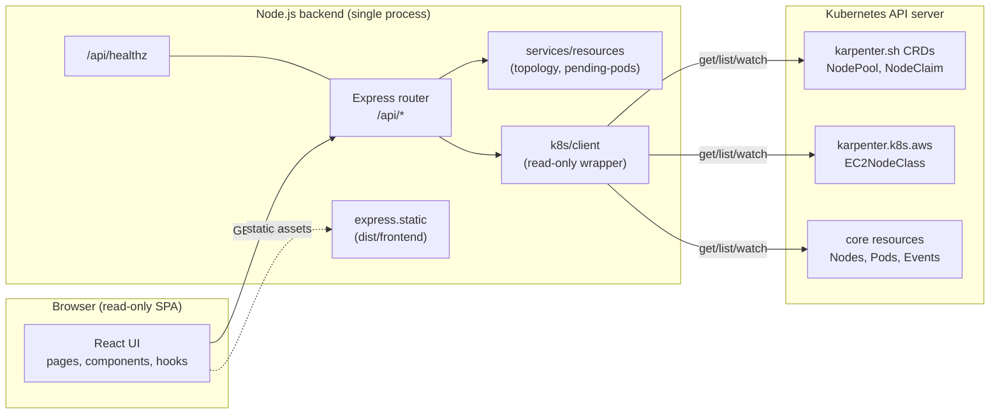

# Karpenter Visualizer — Architecture

This document describes how the Karpenter Visualizer is structured, how a
request flows from the browser to the Kubernetes API server, and what the
trust boundaries look like.

For install, run, and deployment instructions see
[`README.md`](../README.md) at the project root.

---

## 1. Component diagram



The backend is one process: it serves the built frontend in production and
proxies all `/api/*` requests to the Kubernetes API server. There is no
separate API gateway, message queue, or database.

---

## 2. Request / data flow

End-to-end, a page load works like this:

1. The browser loads `index.html` (and the hashed JS/CSS bundles) from
   `dist/frontend`, served by `express.static` in production or Vite in dev.
2. The SPA mounts and React Router renders the requested page.
3. The page issues one or more `fetch('/api/<resource>')` requests. The Vite
   dev server proxies these to `http://localhost:3001`; in production the
   backend serves them directly.
4. The Express router invokes a service in `src/backend/services`, which
   obtains a singleton Kubernetes client (`getK8sClient()`).
5. The client decides whether to use the real or mock implementation:
   - `MOCK_K8S=true` → returns an in-memory client backed by fixtures.
   - otherwise → returns a real client that loaded `KubeConfig` from the
     in-cluster service account or from `KUBECONFIG` / `~/.kube/config`.
6. The client calls `list*` on the appropriate API (CRDs via
   `CustomObjectsApi`, core resources via `CoreV1Api`) and returns the
   `items` array.
7. The service transforms the items (for example, `buildTopology` links
   `NodeClaims` → `Nodes` → `NodePools` → `EC2NodeClasses`).
8. Express serializes the response as JSON and returns `200 OK`.
9. The frontend renders the response and starts the next refresh timer.

Errors are caught by `asyncHandler`, passed through the centralised
`errorMiddleware`, and returned as JSON with a meaningful status code so
the UI can display a banner instead of crashing.

---

## 3. Security model

The threat model is: an attacker who can talk to the backend should not be
able to mutate the cluster or exfiltrate cluster credentials.

### Trust boundaries

| Boundary                   | What crosses it                          | What must not cross it            |
| -------------------------- | ---------------------------------------- | --------------------------------- |
| Browser ↔ backend (HTTP)   | JSON requests, JSON responses, static JS | kubeconfig, tokens, AWS keys      |
| Backend ↔ API server (TLS) | Kubernetes API calls (read-only verbs)   | credentials other than the SA tok |
| CI / image build           | Source code, base image layers           | kubeconfig, `.env`, `*.pem`, `*.key` |

### Read-only guarantee

The read-only guarantee is enforced in **two places**:

1. **RBAC** (`k8s/rbac.yaml`): `ClusterRole` grants only `get`, `list`, and
   `watch` for `nodepools`, `nodeclaims`, `ec2nodeclasses`, `nodes`, `pods`,
   and `events`. The API server will reject any other verb with `403`.
2. **Application** (`src/backend/k8s/client.ts`): the client interface has
   only `list*` methods. There is no helper for `create`, `update`, `patch`,
   or `delete`. To add such a method, the change would have to be reviewed
   alongside an RBAC update.

### Container hardening

The Deployment sets:

- `runAsNonRoot: true`
- `runAsUser: 10001`, `runAsGroup: 10001`
- `readOnlyRootFilesystem: true`
- `allowPrivilegeEscalation: false`
- `capabilities.drop: [ALL]`
- `seccompProfile.type: RuntimeDefault`

It also requests and limits CPU/memory so a runaway request cannot starve
the node.

### Why no auth on the UI?

This MVP is intended to run inside a cluster boundary (VPN, bastion, or
behind an Ingress with SSO). The backend does not implement user
authentication; access control is expected to be provided by the network
path. If you expose the Service to the public internet, put it behind an
authenticating reverse proxy.

---

## 4. API surface

All endpoints return JSON. All endpoints are `GET` except the test-only
`POST` endpoints under `/api/_test/*`, which are only mounted when
`MOCK_K8S=true`.

### Resource endpoints

| Method | Path                          | Description                                                | Response shape             |
| ------ | ----------------------------- | ---------------------------------------------------------- | -------------------------- |
| GET    | `/api/healthz`                | Liveness / readiness probe. Returns uptime + timestamp.    | `HealthResponse`           |
| GET    | `/api/nodepools`              | List all Karpenter `NodePool` objects.                     | `NodePool[]`               |
| GET    | `/api/nodeclaims`             | List all Karpenter `NodeClaim` objects.                    | `NodeClaim[]`              |
| GET    | `/api/ec2nodeclasses`         | List all `EC2NodeClass` objects.                           | `EC2NodeClass[]`           |
| GET    | `/api/nodes`                  | List all core `Node` objects.                              | `V1Node[]`                 |
| GET    | `/api/pods`                   | List all `Pod` objects (cluster-wide).                     | `V1Pod[]`                  |
| GET    | `/api/events`                 | List all `Event` objects (cluster-wide).                   | `CoreV1Event[]`            |
| GET    | `/api/topology`               | Derived topology linking `NodePool` ↔ `NodeClaim` ↔ `Node` ↔ `EC2NodeClass`. | `TopologyResponse` |
| GET    | `/api/pending-pods`           | Pods whose phase is `Pending` and that are not yet assigned to a node. | `PendingPodResponse` |

### Test-only endpoints (mock mode only)

| Method | Path                  | Description                                                              |
| ------ | --------------------- | ------------------------------------------------------------------------ |
| POST   | `/api/_test/seed`     | Replace the in-memory mock cluster data with the supplied payload.       |
| POST   | `/api/_test/schedule` | Mark a pod `Running` on a given node and emit a `Scheduled` event.       |

These endpoints are mounted **only** when `MOCK_K8S=true`. The real
`K8sClient` ignores the flag, so they can never reach the Kubernetes API.

### Error responses

Errors are returned as JSON with a top-level `error` string:

```json
{ "error": "karpenter namespace not found" }
```

The middleware maps known errors to `404` (not found) and unknown errors
to `500` so the UI can show a useful message without leaking internals.

---

## 5. Mock mode

`MOCK_K8S=true` switches the backend to an in-memory client. The mock:

- Returns `[]` for every `list*` call unless `setMockClusterData(...)` has
  been called.
- Reads the same `K8sClient` interface as the real client, so routes and
  services do not need to know which is in use.
- Always reports `hasKarpenterNamespace()` as `true`.
- Mounts the `/_test` router so E2E tests can seed and mutate fixtures.

Mock mode is intended for:

- Local UI development without a real cluster.
- The Playwright E2E suite, which seeds a fixture and then drives the UI.
- Demos where you do not want to grant cluster access to the laptop running
  the visualizer.

To leave mock mode, simply unset `MOCK_K8S` and restart the backend. The
real client will load `KubeConfig` on the first request.

---

## 6. Configuration matrix

| Mode         | `MOCK_K8S` | `KUBECONFIG` set? | Where credentials come from                       |
| ------------ | ---------- | ----------------- | ------------------------------------------------- |
| Mock         | `true`     | (ignored)         | none (in-memory fixtures)                         |
| Local (file) | unset/false | yes              | the kubeconfig file pointed at                    |
| Local (default) | unset/false | no             | `~/.kube/config` (default load)                   |
| In-cluster   | unset/false | (ignored)         | mounted service-account token at `/var/run/secrets/...` |

The same `K8sClient` interface satisfies all four cases — routes never
branch on the mode.
