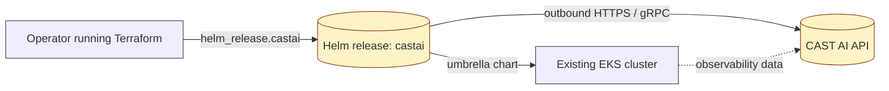
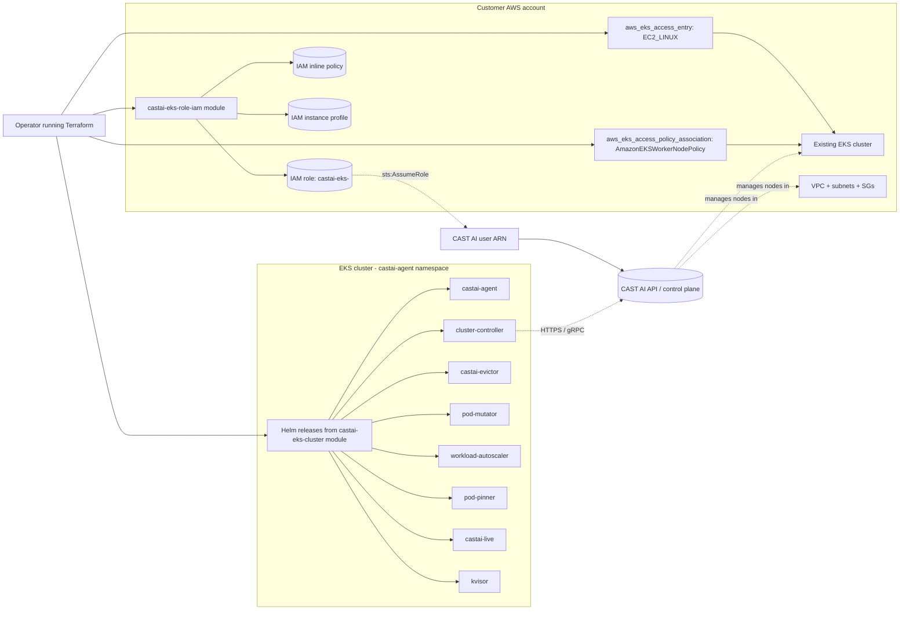

# CAST AI EKS Onboarding — Architecture

This document describes the architecture of the two CAST AI EKS onboarding
modules shipped under `terraform/modules/`:

- `castai-eks-readonly` — Helm-only, observability-first onboarding.
- `castai-eks-full` — full node-management onboarding with cloud IAM,
  EKS access entries, and CAST AI registration.

Both modules assume an **existing EKS cluster** that is owned and operated
by the customer. Neither module creates, imports, or mutates the EKS
cluster, the VPC, the subnets, or any node group. They discover the
cluster via the AWS provider and target it with `helm` and `kubernetes`
providers that use short-lived `aws eks get-token` credentials.

---

## Read-only mode architecture

Read-only mode installs the CAST AI umbrella chart with
`tags.readonly=true`, `tags.full=false`, `tags.node-autoscaler=false`,
and `tags.workload-autoscaler=false`. No CAST AI IAM roles, instance
profiles, policies, or `castai/castai` provider resources are created.
The chart only deploys observability components (agent, spot-handler,
kvisor, gpu-metrics-exporter).



Key properties:

- Only the `helm` and `kubernetes` providers talk to the cluster.
- The `castai/castai` provider is intentionally **not** configured in
  `versions.tf` because read-only mode does not provision nodes or
  create cloud IAM resources.
- The CAST AI API key is delivered to the chart via `set_sensitive`
  (`global.castai.apiKey`) so it is not echoed in plan output.
- The Helm release name, namespace, and chart version are driven by the
  module inputs (`castai_release_name`, `castai_namespace`,
  `castai_chart_version`).

---

## Full-access mode architecture

Full mode composes the upstream `castai/eks-role-iam/castai` and
`castai/eks-cluster/castai` Terraform modules and adds EKS access-entry
resources so the CAST AI node instance profile role can join the
existing cluster.



Sequence summary:

1. `castai_eks_clusterid.cluster_id` and `castai_eks_user_arn.castai_user_arn`
   derive a CAST AI cluster UUID and the CAST AI user ARN that will be
   granted permission to assume the cluster role.
2. `module.castai-eks-role-iam` provisions the per-cluster IAM role,
   inline policy, and instance profile named
   `castai-eks-<cluster_name>`.
3. `aws_eks_access_entry.castai_nodes` (type `EC2_LINUX`) and
   `aws_eks_access_policy_association.castai_nodes_worker` grant the
   instance-profile role cluster access.
4. `module.castai-eks-cluster` registers the cluster with CAST AI,
   installs the umbrella chart in full mode, and creates a default
   `castai_node_configuration` and `castai_node_template`
   (`default_by_castai`).

---

## IAM role/policy design

The full-access module uses the upstream
[`castai/eks-role-iam/castai`](https://registry.terraform.io/modules/castai/eks-role-iam/castai/latest)
module to provision IAM resources per cluster. Because
`create_iam_resources_per_cluster = true` is set, resources are namespaced
with the cluster name.

Naming convention:

- IAM role:        `castai-eks-${cluster_name}`
- Instance profile: `castai-eks-${cluster_name}`
- Inline policy:   attached to the role by the upstream module

The inline policy grants the least-privilege baseline that CAST AI needs
to discover the cluster and launch nodes:

| Capability                | Action baseline                                                                  |
| ------------------------- | -------------------------------------------------------------------------------- |
| EC2 read-only discovery   | `AmazonEC2ReadOnlyAccess` managed policy                                        |
| IAM read-only discovery   | `IAMReadOnlyAccess` managed policy                                               |
| Read cluster metadata     | `eks:DescribeCluster`, `eks:ListClusters` (scoped to the cluster ARN)           |
| Launch CAST AI nodes      | `ec2:RunInstances`, `ec2:CreateNetworkInterface` scoped to CAST AI-owned images |
| Attach node IAM profile   | `iam:PassRole` scoped to `castai-eks-${cluster_name}*` resource ARNs             |
| Tag managed resources     | `ec2:CreateTags`, `ec2:DeleteTags` scoped to the cluster VPC                     |
| Terminate nodes           | `ec2:TerminateInstances`, `ec2:DescribeInstances`                               |
| Network interface cleanup | `ec2:DeleteNetworkInterface`                                                     |

The exact list of permissions is owned by the
[`castai/eks-role-iam/castai`](https://registry.terraform.io/modules/castai/eks-role-iam/castai/latest)
module — do not fork or hand-edit it locally. This document only
describes the intent; the authoritative policy lives in that upstream
module.

---

## Trust relationships

The role trusts the CAST AI user ARN returned by
`castai_eks_user_arn.castai_user_arn`. An optional `ExternalId` can be
applied via the upstream `castai/eks-role-iam/castai` module inputs; the
default is to use the CAST AI user ARN alone.

```json
{
  "Version": "2012-10-17",
  "Statement": [
    {
      "Effect": "Allow",
      "Principal": {
        "AWS": "arn:aws:iam::${castai_account_id}:user/${castai_user_name}"
      },
      "Action": "sts:AssumeRole",
      "Condition": {
        "StringEquals": {
          "sts:ExternalId": "<optional external id>"
        }
      }
    }
  ]
}
```

Notes:

- `Principal.AWS` MUST be the CAST AI user ARN obtained from
  `castai_eks_user_arn.castai_user_arn.arn` after the first apply. Do
  not hard-code a principal ARN in your Terraform configuration.
- The `Condition` block is **optional** and is shown here only to
  document the cross-account hardener pattern recommended by AWS IAM
  best practices.
- No other principals (other AWS accounts, services, or roles) should
  be added to the trust policy of `castai-eks-${cluster_name}`.

---

## EKS Access Entry requirements for full mode

Full mode must add an EKS access entry for the CAST AI node instance
profile role so CAST AI-provisioned nodes can register with the cluster
API server. The full module creates exactly one access entry:

```hcl
resource "aws_eks_access_entry" "castai_nodes" {
  cluster_name  = var.cluster_name
  principal_arn = module.castai-eks-role-iam.instance_profile_role_arn
  type          = "EC2_LINUX"
}

resource "aws_eks_access_policy_association" "castai_nodes_worker" {
  cluster_name  = var.cluster_name
  policy_arn    = "arn:aws:eks::aws:policy/AmazonEKSWorkerNodePolicy"
  principal_arn = module.castai-eks-role-iam.instance_profile_role_arn

  access_scope {
    type = "cluster"
  }
}
```

Properties:

- `principal_arn` is the **role** ARN from the instance profile, not the
  instance profile ARN itself.
- `type = "EC2_LINUX"` is required for Linux worker nodes.
- `policy_arn = "arn:aws:eks::aws:policy/AmazonEKSWorkerNodePolicy"` is
  the minimum policy needed for nodes to join the cluster.
- `access_scope.type = "cluster"` grants cluster-wide access for the
  principal; this is the recommended scope for node IAM roles.

The cluster-controller component (installed by the upstream
`castai-eks-cluster` module) receives its own access via the IAM
role-arn wired into `aws_assume_role_arn`; the controller does not need
a separate `aws_eks_access_entry` because it talks to the cluster API
through Kubernetes RBAC and the assume-role path.

---

## Kubernetes RBAC

Neither module creates Kubernetes RBAC resources directly. All
ClusterRole, ClusterRoleBinding, ServiceAccount, and namespace
resources are created by the CAST AI umbrella Helm chart itself.

Components installed by the chart and the RBAC they require:

| Component            | ServiceAccount                                  | Cluster scope                                                |
| -------------------- | ----------------------------------------------- | ------------------------------------------------------------ |
| `castai-agent`       | `castai-agent:castai-agent`                     | read pods, nodes, namespaces; watch API objects              |
| `castai-kvisor`      | `castai-agent:kvisor` (or similar)              | security event collection; minimal cluster read               |
| `castai-cluster-controller` | `castai-agent:cluster-controller`         | write nodes, leases; manage CAST AI-owned CRDs               |
| `castai-evictor`     | `castai-agent:castai-evictor`                   | create evictions                                             |
| `castai-pod-mutator` | `castai-agent:castai-pod-mutator`               | mutate pods (admission webhook)                              |
| `castai-workload-autoscaler` | `castai-agent:workload-autoscaler`       | scale Deployments / StatefulSets                             |
| `castai-pod-pinner`  | `castai-agent:castai-pod-pinner`                | pin pods to specific nodes                                   |
| `castai-live`        | `castai-agent:castai-live`                      | live-migrate containers across nodes                         |

To verify RBAC after install (see `UPGRADE-ROLLBACK.md` for the full
validation snippet):

```bash
kubectl auth can-i list nodes \
  --as=system:serviceaccount:castai-agent:castai-agent
```

---

## CAST AI components per mode

| Component                     | Read-only (tags) | Full (default tags) |
| ----------------------------- | ---------------- | ------------------- |
| `castai-agent`                | yes              | yes                 |
| `castai-spot-handler`         | yes              | yes                 |
| `castai-kvisor`               | yes              | yes                 |
| `gpu-metrics-exporter`        | yes (bundled)    | yes (bundled)       |
| `castai-cluster-controller`   | no               | yes                 |
| `castai-evictor`              | no               | yes                 |
| `castai-pod-mutator`          | no               | yes                 |
| `castai-workload-autoscaler`  | no               | yes                 |
| `castai-pod-pinner`           | no               | yes                 |
| `castai-live` (live migration)| no               | yes                 |

In read-only mode, `tags.full=false`, `tags.node-autoscaler=false`, and
`tags.workload-autoscaler=false` are set explicitly so the umbrella
chart never installs the automation stack. In full mode the upstream
`castai-eks-cluster` module installs the umbrella chart with the
default tag set, which enables every automation component above
(subject to the `install_security_agent` and `install_workload_autoscaler`
input toggles).

---

## Permission differences table

The table below summarises the effective permissions across the two
modes from the perspective of CAST AI in the customer AWS account.

| Capability                                | Read-only | Full |
| ----------------------------------------- | --------- | ---- |
| Read EC2 / VPC / AMI / SG metadata        | no        | yes  |
| Run/terminate EC2 instances               | no        | yes  |
| Create/delete network interfaces          | no        | yes  |
| Pass IAM role to EC2 (`iam:PassRole`)     | no        | yes (scoped) |
| Read IAM (users/roles/policies)           | no        | yes  |
| Describe / list EKS clusters              | no        | yes  |
| Create EKS access entries                 | no        | yes  |
| Manage node groups / node templates       | no        | yes  |
| Autoscaling group actions                 | no        | yes  |
| Create / patch Kubernetes workloads       | no        | yes  |
| Mutating webhook (pod mutation)           | no        | yes  |
| Evict pods                                | no        | yes  |
| Read-only API access via castai-agent     | yes       | yes  |

---

## Security considerations

- **Terraform state encryption.** The CAST AI API key is sensitive and
  is delivered to the chart via `set_sensitive`, but Terraform state
  still contains the value. Use an encrypted remote backend (S3 + SSE-KMS,
  Terraform Cloud, etc.) with strict IAM access controls and state
  locking (DynamoDB) in production.
- **API token delivery.** Always pass the token via the
  `TF_VAR_castai_api_token` environment variable or a secrets manager
  (AWS Secrets Manager, HashiCorp Vault, SOPS, etc.). Never commit it
  to source control.
- **IAM least privilege.** Use the upstream
  [`castai/eks-role-iam/castai`](https://registry.terraform.io/modules/castai/eks-role-iam/castai/latest)
  module as-is. It scopes `iam:PassRole`, `ec2:RunInstances`, and tag
  permissions to CAST AI-owned resources.
- **Trust policy.** Restrict the trust policy of
  `castai-eks-${cluster_name}` to the CAST AI user ARN. Add an
  `ExternalId` condition if CAST AI supports it for your organisation.
- **IRSA (optional).** The umbrella chart can use IAM Roles for Service
  Accounts instead of the API key path. The modules do not configure
  IRSA — that is a Helm-value concern and is not required for either
  mode to function.
- **Network egress.** The EKS cluster must be able to reach
  `https://api.cast.ai` (REST) and `https://grpc.cast.ai` (gRPC).
  Configure NAT gateway, VPC endpoints, or proxy allow-lists
  accordingly. The `api_url` and `grpc_url` inputs are exposed by the
  full module so non-production CAST AI endpoints can be targeted.
- **Hardcoded secrets.** Neither module hardcodes any credential. All
  authentication material flows through Terraform variables or
  Helm values; the umbrella chart does not embed any secret.
- **State locking.** Always use a backend with state locking (e.g. S3 +
  DynamoDB) when more than one operator may apply changes.
- **Cluster-controller access entry.** The upstream
  `castai-eks-cluster` module handles the cluster-controller access
  entry; do not duplicate it via the `aws_eks_access_entry` resource in
  this module.

---

## Official reference links

- CAST AI EKS onboarding docs: <https://docs.cast.ai/docs/eks>
- CAST AI Terraform provider: <https://registry.terraform.io/providers/castai/castai/latest>
- `castai/eks-role-iam` module: <https://registry.terraform.io/modules/castai/eks-role-iam/castai/latest>
- `castai/eks-cluster` module: <https://registry.terraform.io/modules/castai/eks-cluster/castai/latest>
- AWS EKS access entries: <https://docs.aws.amazon.com/eks/latest/userguide/access-entries.html>
- AWS IAM best practices: <https://docs.aws.amazon.com/IAM/latest/UserGuide/best-practices.html>
